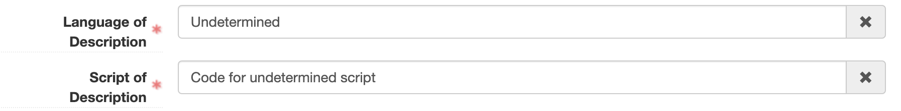
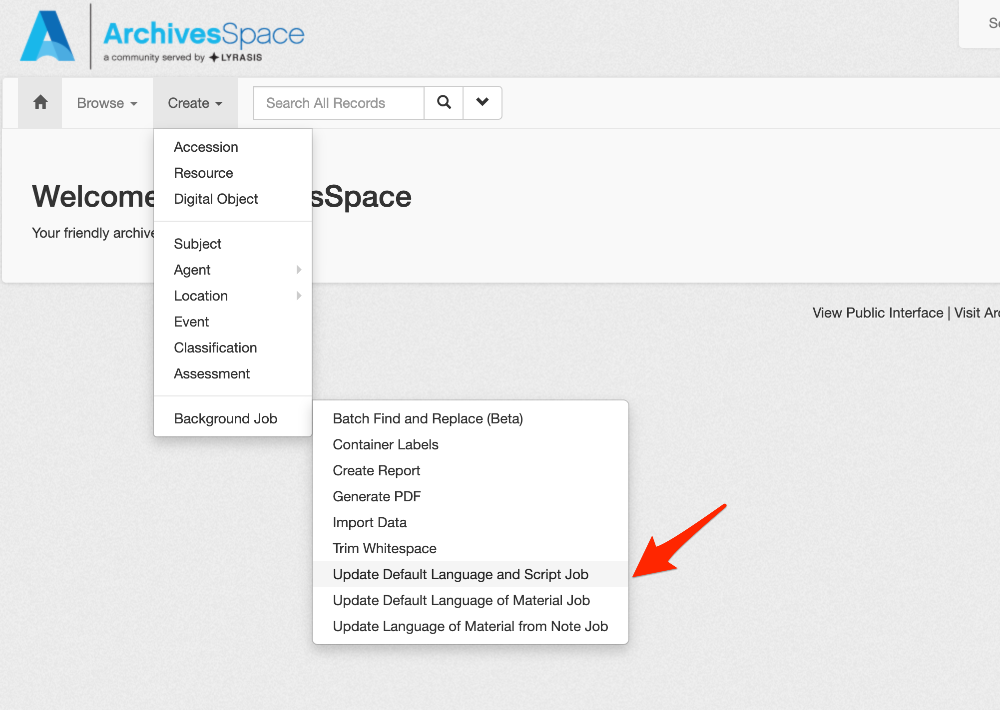
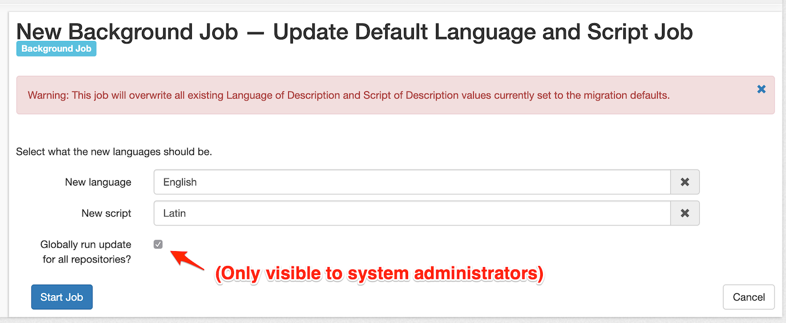
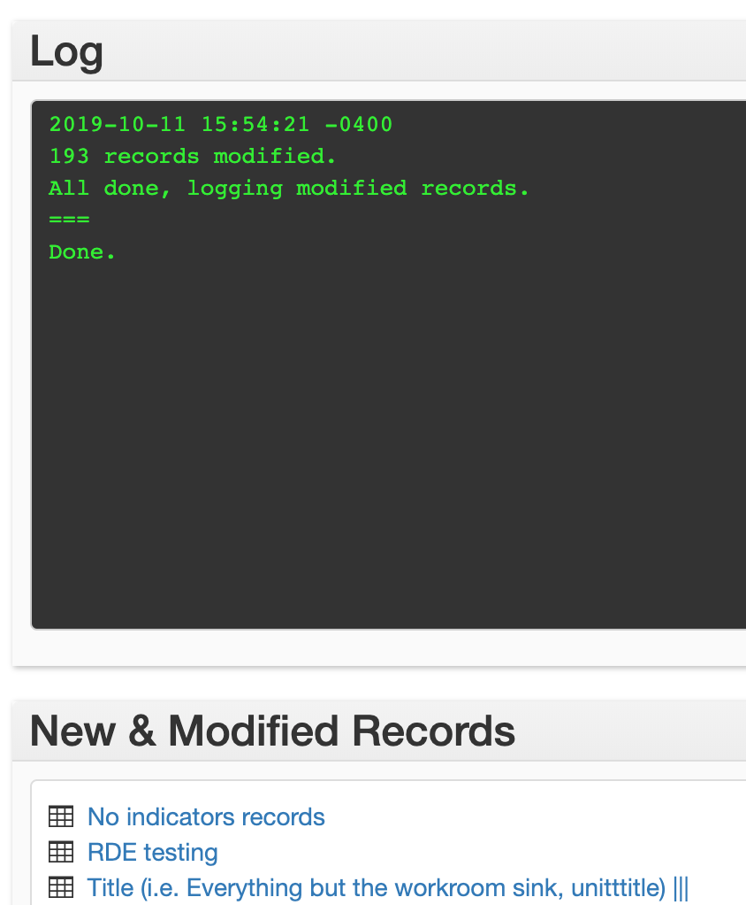
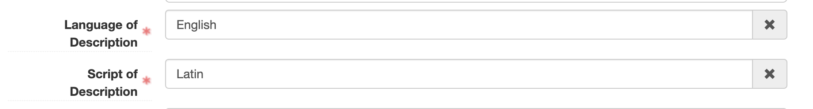

# batch_update_lang_and_script

A plugin to globally update existing default language and/or script of description values of resource records.

## Background

As of ArchivesSpace v2.7.0, a controlled value language and script of description is **required** within the Finding Aid Data section of Resource records. An optional Finding Aid Language Note free-text field is also provided.

The v2.7.0 upgrade includes a database migration that attempts to map existing language of description free-text note fields to the new language and script of description controlled value fields, however the migration is not able to account for all ways in which this content was formerly entered into the free-text Language of Description field.  As a result, default language and script of descriptions of "Undetermined" and "Code for undetermined script" were set.

This plugin allows any user with manage_repository permissions to update **all** Resource records set to these two default values to a language and/or script of description of the user's choosing.

## Using the plugin

After installing the plugin (see below):

1.  While logged in as a repository manager or higher, create a new "Update Default Language And Script" background job.

2.  Select the new controlled value language and/or script of description for all Resource records currently set to the migration defaults.

3.  *(Optional)* If logged in as a System Administrator, select the "Globally run update for all repositories?" checkbox if you wish to populate all Resource records currently set to the migration defaults to the language and/or script selected in step 2.
4.  Submit the job and wait for the job to complete.

5.  After the job completes you may review a list of records updated as part of the background job.  (Note: If you opted to "Globally run" the background job some links in the update records section may lead to "Resource Not Found" pages as those links point to a repository other than the one you are currently logged in to.)

## To install:

1. Stop the application
2. Clone the plugin into the `archivesspace/plugins` directory
3. Add `batch_update_lang_and_script` to `config.rb`, ensuring to uncomment/remove the # from the front of the relevant AppConfig line.  For example:
`AppConfig[:plugins] = ['local', 'batch_update_lang_and_script']`
4. Restart the application
